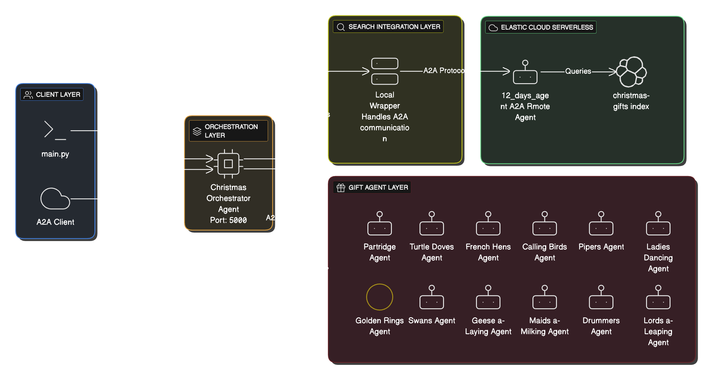

# 12 Days of Christmas - A2A Protocol Demonstration

A Python application demonstrating Google's Agent-to-Agent (A2A) protocol using the classic "12 Days of Christmas" song. This project showcases how multiple specialized agents can coordinate through a main orchestrator agent.

## 🎄 Overview

This project implements a multi-agent system using the [python-a2a](https://github.com/themanojdesai/python-a2a) library, where:

- **12 Gift Agents**: Each agent represents one day's gift from the song (e.g., "5 Golden Rings", "2 Turtle Doves")
- **1 Orchestrator Agent**: Coordinates all gift agents to assemble the complete song

## 🚀 Getting Started

### Prerequisites

- Python 3.8 or higher
- pip package manager

### Installation

1. Clone the repository:
```bash
git clone https://github.com/justincastilla/12-days-of-a2a.git
cd 12-days-of-a2a
```

2. Install dependencies:
```bash
pip install -r requirements.txt
```

### Running the Demo

Run the full demonstration:
```bash
python main.py
```

### Command Line Options

```bash
# Show the complete demo (gift agents + summary + full song)
python main.py

# Show only a specific day's verse
python main.py --day 5

# Show only the gift summary
python main.py --summary

# Show individual agent demonstrations
python main.py --agents

# Search Elastic for information about all gifts (requires .env configuration)
python main.py --elastic

# Search Elastic for a specific day's gift
python main.py --elastic --day 5

# Start as an A2A server (default port: 5000)
python main.py --server

# Start server on a custom port
python main.py --server --port 8080
```

## 🔍 Elastic Agent Builder Integration

This project demonstrates how to integrate a **remote Elastic Agent Builder agent** with local agents using the **A2A protocol**. The Elastic agent searches for enriched information about each Christmas gift, showcasing real-world agent-to-agent communication.

### Why Elastic Agent Builder?

[Elastic Agent Builder](https://www.elastic.co/elasticsearch/agent-builder) provides:
- **Hosted AI agents** that can search your Elasticsearch data
- **A2A protocol support** for seamless agent-to-agent communication
- **Semantic search** capabilities over your indexed documents
- **No infrastructure management** - the agent runs on Elastic Cloud

### Prerequisites for Elastic Integration

1. An Elasticsearch project/deployment running in [Elastic Cloud](https://cloud.elastic.co/registration)
   - Requires Elasticsearch serverless project (or hosted deployments with Elasticsearch version 9.2.0+)
2. Documents indexed in Elasticsearch related to the 12 Days of Christmas gifts
3. An Agent Builder agent configured to search your documents

### Step-by-Step Setup

#### Step 1: Populate Your Elasticsearch Index

Use the provided script to create and populate the `christmas-gifts` index:

```bash
# Configure your Elasticsearch endpoint and API key in .env
cp .env.example .env
# Edit .env and set ES_ENDPOINT and ES_API_KEY

# Run the population script
python populate_elasticsearch.py
```

This creates 78 documents (1 for day 1, 2 for day 2, ..., 12 for day 12) with rich content about each gift. See [README_POPULATE.md](README_POPULATE.md) for details.

#### Step 2: Create an Agent Builder Agent

1. **Navigate to Agent Builder** in your Elastic Cloud console
   - Go to Search → Agent Builder

2. **Create a New Agent**:
   - **Agent ID**: `12_days_agent` (or your preferred name)
   - **Display Name**: `12 Days of Christmas Search Agent`
   - **Description**: `Assists in finding gifts for the 12 days of Christmas`

3. **Add Custom Instructions**:
   ```
   You are an expert on the "12 Days of Christmas" carol. When users ask about
   gifts from the song, search the christmas-gifts index and provide detailed,
   educational information about each gift including historical context,
   symbolism, and cultural significance.
   
   Always cite the specific day number and gift name in your responses.
   ```

4. **Configure Tools**:
   - The agent will automatically have access to Elasticsearch search tools
   - The default `platform.core.search` tool will search the `christmas-gifts` index

5. **Enable A2A Protocol**:
   - Ensure your agent is accessible via the A2A protocol endpoint
   - The endpoint will be: `https://your-project.kb.region.elastic.cloud/api/agent_builder/a2a/`

#### Step 3: Get Your A2A Endpoint URL

1. In Agent Builder, go to the **Tools** page
2. Click the **MCP Server** dropdown
3. Select **Copy MCP Server URL**
4. **Replace** `mcp` at the end with `a2a`
   - Example: `https://example-project.kb.us-central1.gcp.elastic.cloud/api/agent_builder/a2a`

#### Step 4: Create an API Key

1. Navigate to **Elasticsearch** in your Elastic Cloud console
2. Click **Create API key**
3. Give it a descriptive name (e.g., "A2A Integration Key")
4. Copy the API key value

#### Step 5: Configure Environment Variables

Edit your `.env` file with the values from above:

```bash
# Elasticsearch endpoint for data population
ES_ENDPOINT=https://your-project.es.region.elastic.cloud:443

# Elastic Agent Builder A2A endpoint
ES_AGENT_URL=https://your-project.kb.region.elastic.cloud/api/agent_builder/a2a

# Your Elastic API key
ES_API_KEY=your-api-key-here

# Your agent ID (must match what you created in Agent Builder)
ES_AGENT_ID=12_days_agent

# Index name (should match what populate_elasticsearch.py creates)
ES_INDEX_NAME=christmas-gifts
```

#### Step 6: Test the Integration

Test a single day:
```bash
python main.py --elastic --day 5
```

Test all gifts:
```bash
python main.py --elastic
```

You should see responses enriched with information from your Elasticsearch index!

### How the A2A Integration Works

When you run `python main.py --elastic --day 5`, here's what happens:

1. **Orchestrator Agent** (local) receives your request

2. **Agent Card Resolution**:
   - The `ElasticSearchAgent` fetches the agent card from Elastic
   - URL: `https://your-project.kb.region.elastic.cloud/api/agent_builder/a2a/12_days_agent.json`
   - This card describes the Elastic agent's capabilities

3. **A2A Request Sent**:
   ```json
   {
     "message": {
       "role": "user",
       "content": {
         "type": "text",
         "text": "Find information about Golden Rings from the 12 Days of Christmas, day 5"
       }
     }
   }
   ```

4. **Elastic Agent Processes**:
   - Searches the `christmas-gifts` index
   - Finds 5 documents about "Golden Rings"
   - Synthesizes information using AI

5. **A2A Response Received**:
   ```json
   {
     "status": { "state": "COMPLETED" },
     "artifacts": [{
       "parts": [{
         "type": "text",
         "text": "On the fifth day of Christmas, the gift is five golden rings..."
       }]
     }]
   }
   ```

6. **Result Displayed** to the user with enriched information

### Benefits of This Architecture

- **Separation of Concerns**: Local agents handle orchestration, remote agent handles search
- **Scalability**: Elastic Agent Builder handles the search infrastructure
- **Standardization**: A2A protocol enables any A2A-compatible agent to integrate
- **Flexibility**: Easy to swap or add new agents without changing the core application


## 📁 Project Structure

```
12-days-of-a2a/
├── main.py              # Main entry point
├── requirements.txt     # Python dependencies
├── README.md            # This file
└── src/
    ├── __init__.py      # Package init
    ├── gift_agents.py   # 12 gift sub-agents
    └── orchestrator.py  # Main orchestrator agent
```

## 🎁 The 12 Gifts

| Day | Gift | Quantity |
|-----|------|----------|
| 1 | Partridge in a Pear Tree | 1 |
| 2 | Turtle Doves | 2 |
| 3 | French Hens | 3 |
| 4 | Calling Birds | 4 |
| 5 | Golden Rings | 5 |
| 6 | Geese a-Laying | 6 |
| 7 | Swans a-Swimming | 7 |
| 8 | Maids a-Milking | 8 |
| 9 | Ladies Dancing | 9 |
| 10 | Lords a-Leaping | 10 |
| 11 | Pipers Piping | 11 |
| 12 | Drummers Drumming | 12 |

**Total items received: 78**

## 🔧 A2A Protocol Concepts Demonstrated

This project demonstrates key concepts of the Agent-to-Agent (A2A) protocol:

1. **Agent Cards**: Each agent has metadata describing its capabilities
2. **Skills**: Agents expose specific skills (e.g., `get_gift`, `get_day_verse`)
3. **Tasks**: Agents handle tasks and return responses with artifacts
4. **Orchestration**: The main agent coordinates multiple sub-agents
5. **Remote Agent Integration**: Connect to external agents via A2A protocol (Elastic Agent Builder)

### Agent Architecture

The application uses three types of agents communicating via A2A protocol:



**Architecture Overview:**

- **User/Client Layer**: Command-line interface or external A2A clients
- **Orchestrator Agent (Local)**: Coordinates all gift agents and Elastic integration
- **Gift Agents (Local)**: 12 specialized agents, one for each day of Christmas
- **Elastic Agent (Remote)**: Hosted on Elastic Cloud, performs semantic search over indexed documents

### Agent Card Examples

Each agent exposes an **Agent Card** that describes its capabilities in JSON format. Here are examples from this project:

#### 1. Orchestrator Agent Card

When you request the agent card from `http://localhost:5000/.well-known/agent.json`, you get:

```json
{
  "name": "Christmas Orchestrator Agent",
  "description": "Coordinates all 12 gift agents to perform the 12 Days of Christmas",
  "url": "http://localhost:5000",
  "version": "1.0.0",
  "protocolVersion": "0.3.0",
  "capabilities": {
    "streaming": false,
    "pushNotifications": false,
    "stateTransitionHistory": false
  },
  "skills": [
    {
      "id": "get_day_verse",
      "name": "Get Day Verse",
      "description": "Get the verse for a specific day of Christmas",
      "tags": ["christmas", "verse", "day"],
      "inputModes": ["text/plain"],
      "outputModes": ["text/plain"]
    },
    {
      "id": "get_full_song",
      "name": "Get Full Song",
      "description": "Get the complete 12 Days of Christmas song",
      "tags": ["christmas", "song", "complete"],
      "inputModes": ["text/plain"],
      "outputModes": ["text/plain"]
    },
    {
      "id": "get_gift_summary",
      "name": "Get Gift Summary",
      "description": "Get a summary of all gifts",
      "tags": ["christmas", "gifts", "summary"],
      "inputModes": ["text/plain"],
      "outputModes": ["text/plain"]
    },
    {
      "id": "search_gift_with_elastic",
      "name": "Search Gift with Elastic",
      "description": "Search for information about a specific gift using Elastic",
      "tags": ["christmas", "gift", "elastic", "search"],
      "inputModes": ["text/plain"],
      "outputModes": ["text/plain"]
    }
  ]
}
```

#### 2. Gift Agent Card (Day 5 Example)

When you request the agent card from `http://localhost:5005/.well-known/agent.json`, you get:

```json
{
  "name": "Day 5 Gift Agent",
  "description": "Provides the gift for day 5 of Christmas: 5 Golden Rings",
  "url": "http://localhost:5005",
  "version": "1.0.0",
  "protocolVersion": "0.3.0",
  "capabilities": {
    "streaming": false,
    "pushNotifications": false,
    "stateTransitionHistory": false
  },
  "skills": [
    {
      "id": "get_gift",
      "name": "Get Gift",
      "description": "Get the gift for day 5 of Christmas",
      "tags": ["christmas", "gift", "day5"],
      "inputModes": ["text/plain"],
      "outputModes": ["text/plain"]
    },
    {
      "id": "get_gift_with_elastic",
      "name": "Get Gift with Elastic",
      "description": "Get the gift for day 5 with information from Elastic search",
      "tags": ["christmas", "gift", "elastic", "day5"],
      "inputModes": ["text/plain"],
      "outputModes": ["text/plain"]
    }
  ]
}
```

#### 3. Elastic Agent Builder Card (Remote)

The Elastic Agent Builder agent is hosted remotely and returns an agent card via the A2A protocol from `https://your-project.kb.region.elastic.cloud/api/agent_builder/a2a/12_days_agent.json`:

```json
{
  "name": "12_days Agent",
  "description": "Assists in finding gifts for the 12 days of Christmas",
  "url": "https://your-project.kb.region.elastic.cloud/api/agent_builder/a2a/12_days_agent",
  "provider": {
    "organization": "Elastic",
    "url": "https://elastic.co"
  },
  "version": "0.1.0",
  "protocolVersion": "0.3.0",
  "capabilities": {
    "streaming": false,
    "pushNotifications": false,
    "stateTransitionHistory": false
  },
  "securitySchemes": {
    "authorization": {
      "type": "apiKey",
      "name": "Authorization",
      "in": "header",
      "description": "Authentication token"
    }
  },
  "defaultInputModes": ["text/plain"],
  "defaultOutputModes": ["text/plain"],
  "skills": [
    {
      "id": "platform.core.search",
      "name": "platform.core.search",
      "description": "A powerful tool for searching and analyzing data within your Elasticsearch cluster. It supports both full-text relevance searches and structured analytical queries.",
      "tags": ["tool"],
      "examples": [],
      "inputModes": ["text/plain", "application/json"],
      "outputModes": ["text/plain", "application/json"]
    },
    {
      "id": "platform.core.get_document_by_id",
      "name": "platform.core.get_document_by_id",
      "description": "Retrieve the full content (source) of an Elasticsearch document based on its ID and index name.",
      "tags": ["tool"],
      "inputModes": ["text/plain", "application/json"],
      "outputModes": ["text/plain", "application/json"]
    },
    {
      "id": "platform.core.list_indices",
      "name": "platform.core.list_indices",
      "description": "List the indices, aliases and datastreams from the Elasticsearch cluster.",
      "tags": ["tool"],
      "inputModes": ["text/plain", "application/json"],
      "outputModes": ["text/plain", "application/json"]
    }
  ],
  "supportsAuthenticatedExtendedCard": false
}
```

### A2A Message Format Examples

Agents communicate using standardized A2A messages. Here are examples of the three main types of interactions:

#### Example 1: Request from User to Orchestrator

When you run `python main.py --elastic --day 5`, the orchestrator receives:

```json
{
  "message": {
    "role": "user",
    "content": {
      "type": "text",
      "text": "Search for information about day 5 gift with elastic"
    }
  }
}
```

#### Example 2: Request from Orchestrator to Gift Agent

The orchestrator may query a gift agent to get base information:

**Request to Day 5 Gift Agent:**
```json
{
  "message": {
    "role": "user",
    "content": {
      "type": "text",
      "text": "Get the gift for day 5"
    }
  }
}
```

**Response from Day 5 Gift Agent:**
```json
{
  "taskId": "task_12345",
  "status": {
    "state": "COMPLETED",
    "message": "Task completed successfully"
  },
  "artifacts": [
    {
      "index": 0,
      "parts": [
        {
          "type": "text",
          "text": "5 Golden Rings"
        }
      ]
    }
  ],
  "message": {
    "role": "assistant",
    "content": {
      "type": "text",
      "text": "5 Golden Rings"
    }
  }
}
```

#### Example 3: Request from Orchestrator to Elastic Agent

The orchestrator sends an A2A request to the remote Elastic agent:

**Request to Elastic Agent:**
```json
{
  "message": {
    "role": "user",
    "content": {
      "type": "text",
      "text": "Find information about Golden Rings from the 12 Days of Christmas, day 5"
    }
  }
}
```

**Response from Elastic Agent:**
```json
{
  "taskId": "elastic_task_67890",
  "status": {
    "state": "COMPLETED",
    "message": "Search completed successfully"
  },
  "artifacts": [
    {
      "index": 0,
      "parts": [
        {
          "type": "text",
          "text": "On the fifth day of Christmas, the gift is five golden rings. These rings are perfect circles that symbolize completeness and perfection. The golden material they're made from brings warmth and light during the cold winter season, making them both symbolically and visually significant in the Christmas tradition.\n\nThe five golden rings represent the first five books of the Old Testament: Genesis, Exodus, Leviticus, Numbers, and Deuteronomy, known as the Pentateuch or Torah.\n\nGold rings were among the most valuable gifts one could give, representing wealth, status, and deep affection. Their brilliance and durability made them perfect symbols of lasting love."
        }
      ]
    }
  ],
  "messages": [
    {
      "role": "assistant",
      "content": {
        "type": "text",
        "text": "On the fifth day of Christmas, the gift is five golden rings..."
      }
    }
  ]
}
```

### Complete Demo Flow: A Request Journey

Let's trace a complete request through the system when you run:

```bash
python main.py --elastic --day 5
```

#### Step 1: User Request Initiation

```
User Command: python main.py --elastic --day 5
      ↓
Main Entry Point: Calls orchestrator.search_gift_info(5)
```

#### Step 2: Orchestrator Processes Request

```python
# In orchestrator.py
def search_gift_info(self, day: int) -> str:
    gift_info = GIFTS[5]  # {"gift": "Golden Rings", "quantity": 5}
    gift_name = gift_info['gift']
    
    # Call the Elastic agent via A2A protocol
    elastic_info = search_gift(gift_name, day)
```

#### Step 3: Elastic Agent Card Resolution

The local `ElasticSearchAgent` wrapper fetches the remote Elastic agent's card to discover its capabilities:

```
HTTP GET: https://your-project.kb.region.elastic.cloud/api/agent_builder/a2a/12_days_agent.json
Headers: Authorization: ApiKey your-api-key

Response: Agent Card JSON from remote Elastic Agent Builder (see Agent Card Examples above)
```

The remote agent card tells the local wrapper:
- What skills the remote Elastic agent has
- What input/output formats it supports
- How to communicate with it

#### Step 4: A2A Request to Elastic Agent

```
HTTP POST: https://your-project.kb.region.elastic.cloud/api/agent_builder/a2a/12_days_agent
Headers: 
  Authorization: ApiKey your-api-key
  Content-Type: application/json

Body:
{
  "message": {
    "role": "user",
    "content": {
      "type": "text",
      "text": "Find information about Golden Rings from the 12 Days of Christmas, day 5"
    }
  }
}
```

#### Step 5: Elastic Agent Processing

Inside Elastic Cloud, the agent:

1. **Receives the A2A request**
2. **Parses the query**: "Golden Rings" + "day 5"
3. **Searches the `christmas-gifts` index**:
   ```
   Finds 5 documents matching:
   - gift_name: "Golden Rings"
   - day: 5
   ```
4. **Synthesizes information** using AI from the document contents
5. **Formats A2A response** with the synthesized answer

#### Step 6: Elastic Agent Response

```json
{
  "taskId": "elastic_task_67890",
  "status": {
    "state": "COMPLETED"
  },
  "artifacts": [
    {
      "parts": [
        {
          "type": "text",
          "text": "On the fifth day of Christmas, the gift is five golden rings. These rings are perfect circles that symbolize completeness and perfection..."
        }
      ]
    }
  ]
}
```

#### Step 7: Orchestrator Assembles Final Response

The orchestrator combines:
- Base gift info: "Day 5: 5 Golden Rings"
- Elastic search results: The detailed information from the response

```python
result = f"Day {day}: {quantity} {gift_name}\n\n"
result += f"Information from Elastic:\n{elastic_info}"
```

#### Step 8: Display to User

```
Day 5: 5 Golden Rings

Information from Elastic:
On the fifth day of Christmas, the gift is five golden rings. These rings 
are perfect circles that symbolize completeness and perfection. The golden 
material they're made from brings warmth and light during the cold winter 
season, making them both symbolically and visually significant in the 
Christmas tradition.

The five golden rings represent the first five books of the Old Testament: 
Genesis, Exodus, Leviticus, Numbers, and Deuteronomy, known as the 
Pentateuch or Torah.

Gold rings were among the most valuable gifts one could give, representing 
wealth, status, and deep affection. Their brilliance and durability made 
them perfect symbols of lasting love.
```

#### Flow Summary

```
┌─────────────────────────────────────────────────────────────────┐
│ User: python main.py --elastic --day 5                          │
└────────────────────────────┬────────────────────────────────────┘
                             │
                             ▼
┌─────────────────────────────────────────────────────────────────┐
│ Orchestrator Agent (Local)                                      │
│ - Parses day 5 request                                          │
│ - Looks up gift: "Golden Rings"                                 │
│ - Prepares A2A request for Elastic                              │
└────────────────────────────┬────────────────────────────────────┘
                             │
                             │ A2A Protocol (HTTPS)
                             ▼
┌─────────────────────────────────────────────────────────────────┐
│ Elastic Agent (Remote - Elastic Cloud)                          │
│ - Receives A2A request                                          │
│ - Searches christmas-gifts index                                │
│ - Finds 5 documents about Golden Rings                          │
│ - Synthesizes answer with AI                                    │
│ - Returns A2A response                                          │
└────────────────────────────┬────────────────────────────────────┘
                             │
                             │ A2A Response
                             ▼
┌─────────────────────────────────────────────────────────────────┐
│ Orchestrator Agent (Local)                                      │
│ - Receives Elastic response                                     │
│ - Combines base gift info + Elastic info                        │
│ - Formats final output                                          │
└────────────────────────────┬────────────────────────────────────┘
                             │
                             ▼
┌─────────────────────────────────────────────────────────────────┐
│ User sees enriched information about Golden Rings               │
└─────────────────────────────────────────────────────────────────┘
```

**Key Takeaways:**
- **Standardized Communication**: All agents use the same A2A message format
- **Remote Agent Integration**: Elastic agent runs on Elastic Cloud, not locally
- **Seamless Orchestration**: The orchestrator handles all agent coordination
- **Rich Responses**: Combining multiple agent responses creates enriched output

### Populating Elasticsearch

To populate your Elasticsearch instance with the Christmas gifts dataset, see [README_POPULATE.md](README_POPULATE.md) for detailed instructions.

The `populate_elasticsearch.py` script will create:
- 1 document about "a Partridge in a Pear Tree"
- 2 documents about "Turtle Doves"
- 3 documents about "French Hens"
- ... and so on up to 12 documents about "Drummers Drumming"

Total: **78 documents** with unique, educational content about each gift.

## 📚 Learn More

- [Python A2A Library](https://github.com/themanojdesai/python-a2a)
- [Google A2A Protocol](https://google.github.io/A2A/)
- [A2A Documentation](https://python-a2a.readthedocs.io/)
- [Elastic Agent Builder](https://www.elastic.co/elasticsearch/agent-builder)
- [Elastic Agent Builder A2A Example](https://github.com/elastic/elasticsearch-labs/tree/main/supporting-blog-content/agent-builder-a2a-agent-framework)

## 📄 License

This project is open source and available under the MIT License.
